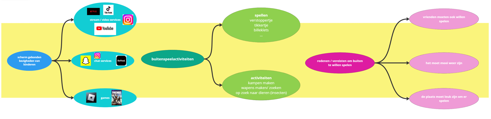
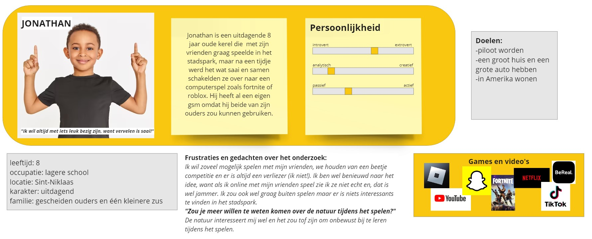
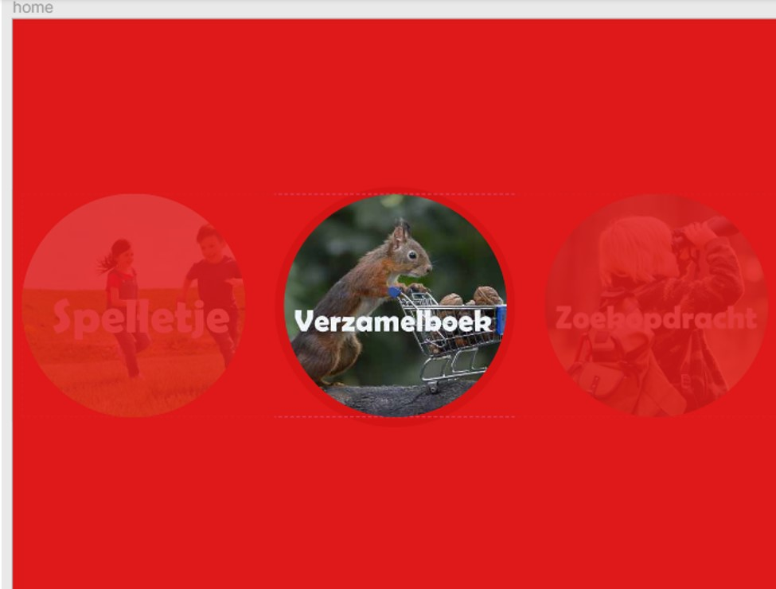
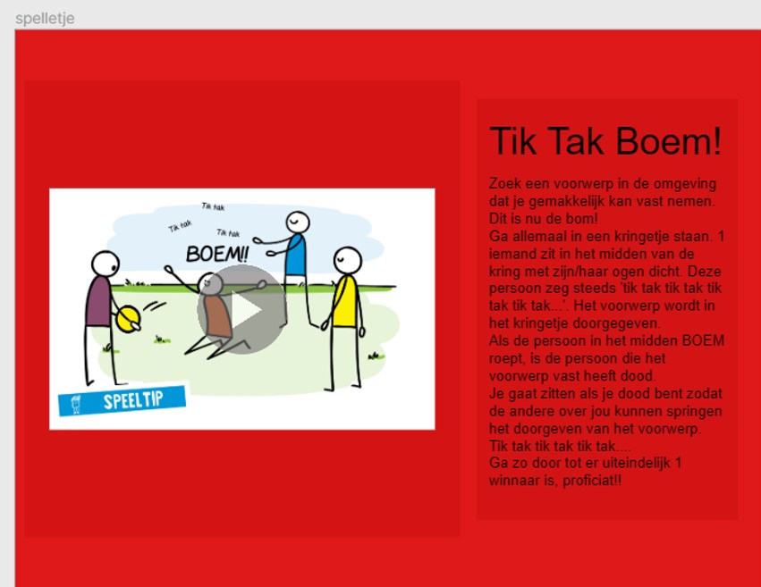
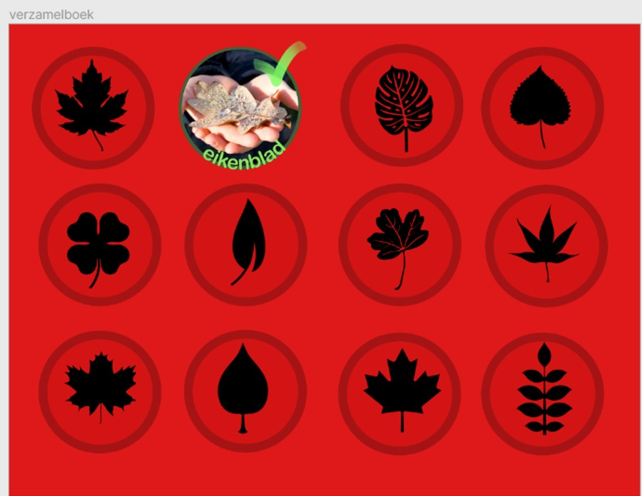
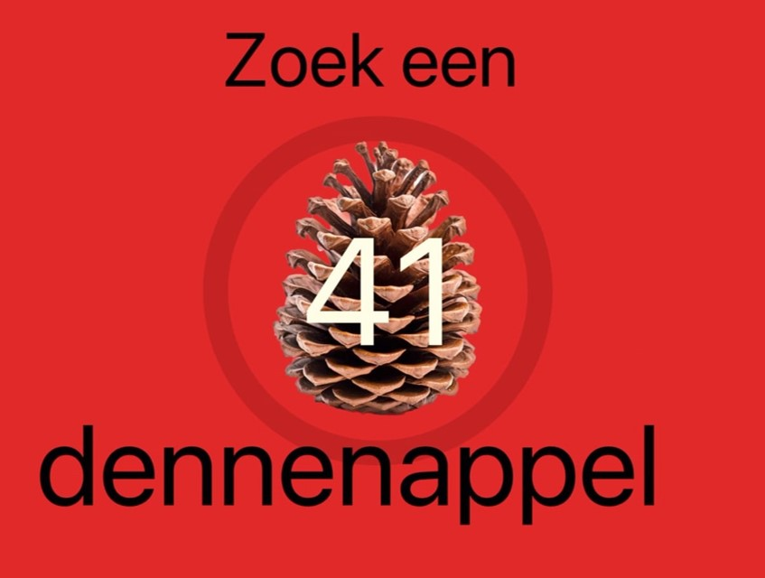
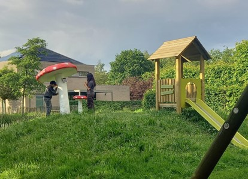
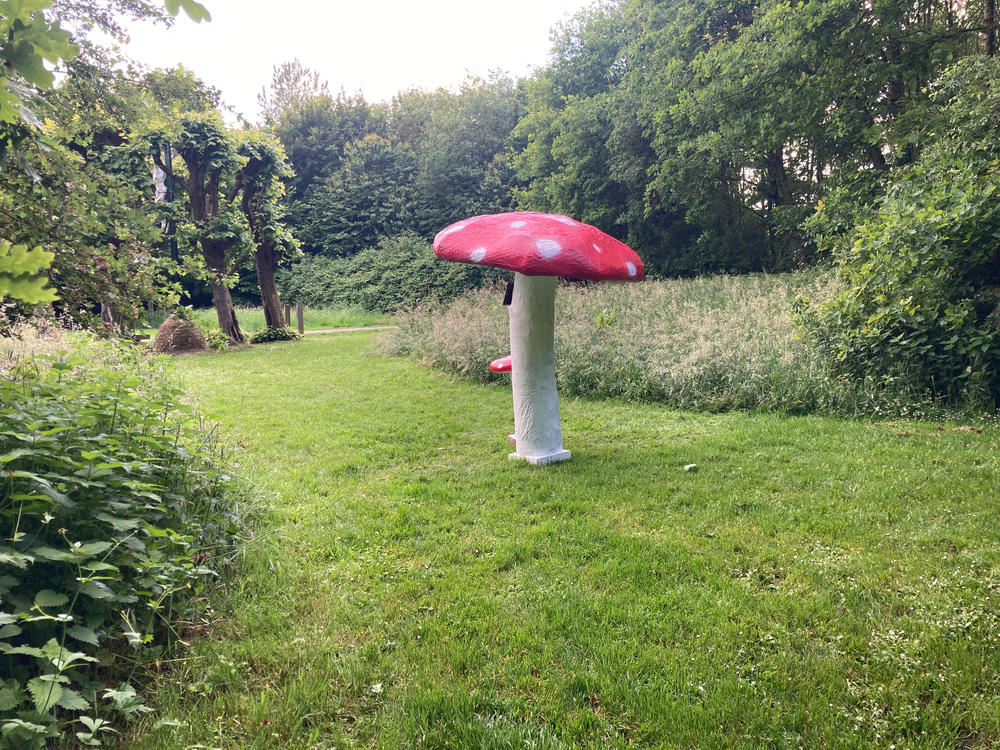

# John de Champignon 

*John de Champignon heeft als doel een natuurvriend vol weetjes te zijn, een inspiratiebron voor spelletjes en een ruststop met een fantasierijk verhaal voor zijn gebruikers.*

*Projectteam: Sterre Van de Velde; Seppe Nijs*

24/01/2024
## Overzicht 
John de Champignon komt voort uit een heel traject vol met gebruikerstesten, prototypes, theoretische modellen ... De vraag waar wij een oplossing voor bieden met ons product luidt als volgt:

>_'Hoe kunnen we publieke plaatsen aantrekkelijker maken voor kinderen aan de hand van technologie?'._


 Doorheen het project zijn daar randvoorwaarden aan toegevoegd, de belangrijkste zijn:

> [!IMPORTANT]
> Randvoorwaarden:
> - Geen gebruik van GSM tijdens het gebruik van ons product.
> - Geen extra fysieke objecten die worden meegegeven met de kinderen.
> - Kinderen laten (opnieuw) in contact komen met de natuur.
> - Stapje terug zetten van doelloos schermgebruik.

Dit verslag bestaat uit 2 grote delen, namelijk semester 1 en semester 2. Bij elk deel worden de methodologie en verschillende testen alsook conclusies en iteraties besproken. Op het einde van semester 1 volgt een kritische reflectie. Op het einde van semester 2 volgt er een algemene kritische reflectie over het hele traject. 
## Semester 1
### Samenvatting visie 
Om stadsparken en openbare ruimten aantrekkelijker te maken voor kinderen zonder een overmatige focus op mobiele telefoons, hebben we een diepgaand onderzoek uitgevoerd door kinderen, ouders en experts binnen de doelgroep te interviewen. Met behulp van benchmarks en deze interviews hebben we een gestructureerde ideeëngeneratie bereikt. 

Onze oplossing is een interactieve speelkast in een nog onbekende, maar aantrekkelijke en mooie vorm. Dit product motiveert kinderen om de natuur in te gaan voor opdrachten en punten te verdienen, of stelt spelletjes voor die rekening houden met de omgeving. Dit bevordert buitenspelen en het verbeteren van scores.

De natuurtotem creëert niet alleen een boeiende bezigheid voor kinderen in stadsparken, maar verrijkt ook de parkervaring voor ouders. Kinderen kunnen zich concentreren op buitenspelen, terwijl ouders zich ontspannen op een bank. Het gebruik hiervan elimineert de noodzaak van een mobiele telefoon, waardoor mogelijke afleiding wordt geminimaliseerd. Deze innovatieve benadering zorgt voor een gezonde balans tussen technologie en buitenactiviteiten, waardoor stadsparken een stimulerende omgeving worden voor kinderen om te leren, te spelen en van de natuur te genieten.


### Introductie 
Er is gekozen voor het onderwerp “_Nature, Tech and Play_”. De probleemstelling ontstond vanuit de '_How can we_’ -vraag, specifiek gericht op de uitdaging om openbare plaatsen aantrekkelijker te maken voor kinderen met behulp van technologie. Het gekozen concept is de natuurtotem op een vaste locatie, die fungeert als een helpende hand en inspiratiebron voor buitenspellen voor kinderen.

Het overkoepelende doel van dit ontwerpproject is om kinderen aan te moedigen buiten te spelen met behulp van technologie. Dit hoofddoel is onderverdeeld in verschillende doelstellingen. Een eerste aandachtspunt is de “_user-interaction_”. Het moet toegankelijk zijn voor kinderen en zichzelf intuïtief wijzen op het gebruik. Technologie speelt ook een cruciale rol, het product moet bestand zijn tegen zowel weer als vandalisme. Tegenwoordig moet er ook grondig worden nagedacht over de soorten energie die worden gebruikt en waar deze vandaan komen. Bovendien moet rekening worden gehouden met de omgeving, zodat het geen storende factor wordt voor bijvoorbeeld stadsbewoners of natuurliefhebbers.

De ontwikkeling van de natuurtotem vereist een doordachte aanpak om de veelzijdige aspecten van gebruikersbetrokkenheid, technologische duurzaamheid, energiezuinigheid en integratie in de omgeving aan te pakken. Door deze overwegingen te combineren, streeft het project ernaar een waardevolle bijdrage te leveren aan het stimuleren van buitenspelen voor kinderen met behulp van technologie.

Enkele “_boundary conditions_” die een rol spelen in het verhaal worden hier besproken. Bij het gebruik van de natuurtotem is de gebruiker volledig onafhankelijk van andere technologie zoals een gsm. Ook zullen de spelen meteen kunnen worden gespeeld, dus er is geen nood aan extra voorwerpen of materialen. Het gebruik van het prodcut wordt beperkt tot 1 plek. De natuurtotem zal zich dus niet verplaatsen en de kinderen kunnen zich steeds naar dezelfde plaats begeven om tijd buiten te vertoeven. Bij de “user interface” moet er ook op gelet worden dat er niet overboord gegaan wordt met de interface (eventueel “_touch_” vermijden). 

Kort gezegd, de natuurtotem moet een interessant en leuk hulpmiddel zijn om kinderen buiten te laten spelen zonder zelf heel de tijd in de belangstelling te staan. 


### Methodologie
Dit project werd geleid door “_user-centered design_”. Dit betekent dat het ontwerpproces geleid werd door de gebruikers aan de hand van gebruikersinterviews en -testen. Momenteel limiteren we ons nog in de “_concept development_”.  Alles  systeem- en afwerking gericht zal in het tweede semester besproken worden.
Hieronder is er een tijdlijn te zien waar de ondernomen stappen chronologisch gerangschikt zijn. Deze stappen zijn gegroepeerd onder drie fasen: de onderzoeksfase, de realisatiefase en de testfase.


Bij de conceptselectie is “_Nature Tech and Play_” gekozen. Er is hier het meest vrijheid in de conceptualisatie, maar de doelgroep ligt hierbij al redelijk vast: kinderen die te veel op hun schermen zitten en meer buiten moeten komen. Het leeftijdsinterval bij het project ligt tussen 6 en 13 jaar. Zoals eerder vermeld wordt het ontwerpproces geleid door de gebruikers/doelgroep, maar ook enkele indirecte gebruikers. Om nuttige informatie uit deze personen in kwestie te vergaren, werden verschillende soorten interviews op verschillende tijdstippen gepland. 

De eerste “_problem interviews_” werden uitgevoerd met 2 kinderen uit de doelgroep, hun ouders en een expert op vlak van het entertainen van kinderen. Bij deze interviews werden er vragen over het probleem gesteld, zodat er een duidelijk persona kon opgesteld worden en de noden van de kinderen en ouders verduidelijkt konden worden. 

In de realisatiefase vond er een spontaan interview plaats met een focusgroep (n=5) waarbij er zonder formaliteiten kon gesproken worden over het onderwerp. Dit gaf meer plaats voor eerlijkheid en kritiek over het onderwerp en het bedachte concept. In de testfase van het project vonden er nog drie interviews plaats waarvan de eerste meer een gebruikerstest was met één van de gemaakte prototypes. Een van de ontwerpers nam plaat in het prototype en speelde als de computer van het product, een soort rollenspel. Verschillende kinderen konden op die manier interageren met het product alsof het ‘echt’ was. Het tweede interview in de testfase vond plaats in Gent met enkele studenten die realistische inzichten gaven over het concept. In het laatste interview werd er rekening gehouden met de nieuwe info van het voorgaande interview. Hierbij werd een kleiner prototype gebruikt en werden de vragen gericht naar de omgeving van de doelgroep.

## Discovery (sem 1)

### Doelstellingen
De onderzoeksfase diende om:

•	Een beter beeld te creëren over de noden van zowel de doelgroep als de indirecte gebruikers, de ouders en zo het probleem verder te analyseren. 

•	Uitzoeken welke activiteiten de doelgroep heeft, zowel op een scherm als buiten.

•	Inzicht verwerven over bestaande producten en diensten die het gestelde probleem al (deels) oplossen of er alleszins iets mee te maken hebben.

•	Voorgaande info toepassen op het project om zo een uniek concept te realiseren. 

### Methodiek en resultaten 
Door enkele interviews met twee kinderen binnen de doelgroep en hun ouders werden de noden en problemen rond het onderwerp van beide partijen verduidelijkt. Zo wouden de kinderen onder andere een manier om met meerdere mensen het product te gebruiken, eventueel een groepsactiviteit. Bij de ouders stond veiligheid op nummer één. Onderstaande afbeelding stelt een verclustering voor van de schermgebonden activiteiten, buitenspeelactiviteiten en de vereisten van de kinderen om buiten te kunnen spelen.



De interviews gaven ook genoeg inzicht om een persona (onderstaande figuur) te creëren wat cruciaal is in het ontwerpproces omdat het: helpt bij het begrijpen van echte behoeften en doelen van de doelgroep, begrip creëert voor gebruikersperspectieven, dient als leidraad voor uniforme besluitvorming, als effectief middel fungeert voor het delen van gebruikersinformatie en personalisatie mogelijk maakt.



Benchmarking (online) was ook één van de onderzoeksmethoden die werd toegepast. Er werd gezocht naar diensten of producten die kinderen entertainen in de buitenlucht en/ of bezighouden met technologie waarbij ze eventueel ook iets bijleren bij het gebruik. Enkele voorbeelden zijn: Pokémon go, een mobile game waarbij je over heel de wereld pokémon kan vangen en je moet buiten komen om het spel te spelen, geocashing, waarbij je schatten moet gaan zoeken in de natuur met behulp van een app en de interactieve tablets in musea waarbij je al spelend bijleert, enzovoort. Deze en nog vele andere werden onderzocht waarna de problemen en positieve aspecten van elk werden aangetoond en uiteindelijk een conclusie getrokken werd bij elk van de benchmarks. Hierna werd een algemene conclusie van eisen getrokken waar het product mimimaal aan moet voldoen:

•	Er mogen geen fysieke objecten meegegeven worden met de kinderen omwille van schade of diefstal.

•	Er moet een soort rangsysteem geïmplementeerd worden dat de kinderen aandrijft om kinderen aan te moedigen.

•	Het product moet tegen het weer en vandalisme bestand zijn en moet makkelijk van energie te voorzien zijn. (Neem als voorbeeld een parkeerautomaat.)

•	Het gebruik van een gsm moet minimaal tot niets zijn bij het gebruik van het product.

•	Het product moet op een vaste locatie staan met voldoende mogelijkheden tot samenspel.

•	Informatie moet aan de hand van audio gegeven worden.

•	Indien het doel is om kinderen iets bij te leren moet dit verborgen zijn onder leuke activiteiten.

•	De interface van het product moet simpel genoeg zijn om niet afleidend te zijn bij het spelen of leren. Een slecht voorbeeld hiervan zijn sommige tablets in musea waarbij kinderen gefascineerd zijn door het “_touch_” aspect en in het wilde gewoon op knopjes drukken zonder doel.

•	Een soort beloning geven bij het gebruik van het product.

Eens dat de doelgroep, problemen, eisen en bestaande concepten aangekaart waren, kon er een nieuw product ontworpen worden. Dit werd gedaan door middel van een morfologische kaart en enkele “_knowledge templates_” waaronder een “_problem-solution matrix_” zichtbaar hieronder. 


### Motivatie
Benchmarking werd gekozen omdat het niet alleen vertrouwt is, maar ook omdat het verschillende inzichten geeft op concurrerende producten en hun positieve en negatieve aspecten. Door deze dan te gaan filteren kan er in theorie het perfecte uitgefilterd worden. In praktijk is dit moeilijker. User-en expert interviews gaven visies op het concept. Zo konden eerder gestelde vragen beantwoord worden en dieper ingaan worden op de noden van de doelgroep en indirecte aanhangers (ouders).
### Conclusies & implicaties
Uit de vele mogelijkheden werd één enkele gefilterd: een speelkast met volgende eigenschappen:

•	Gelinkt aan een vaste locatie en weet welke flora en fauna er zijn en geeft spelletjes en opdrachtjes a.d.h.v. deze locatie.

•	Beschikt over interactieve schermen, knoppen, boxen (audio), een lens met AI (zoals Leafsnap) voor planten en foto’s te nemen en een geanimeerd gezicht.

•	Geeft voorstellen van spelletjes die kinderen kunnen spelen.

•	Geeft leuke weetjes over de natuur waarin men zich bevindt.

•	Geeft opdrachtjes om bosmateriaal te verzamelen. Bijvoorbeeld: zoek een eikenblad (indien deze op deze locatie te vinden is) en de speler krijgt een score op hoe snel hij/zij het vindt. -> leaderboard -> competitie.

•	Heeft een groot verzamelboek waar kinderen kunnen bijdragen door de nog niet gevonden bosmaterialen (bladeren van verschillende bomen, mos, noten…) te zoeken en ze in te scannen bij de robot (zoals kaarten verzamelen). Hier kunnen ook weer spelletjes met tijd aan vast hangen.

•	Kinderen worden beloond door middel van een ‘winnaarsfoto’, tekening op het leaderbord...

•	Punten worden samen verdiend en het is de bedoeling dat verschillende steden tegen elkaar spelen om zo een beloning, bijvoorbeeld een upgrade aan het speeltuig, te krijgen.

Om een visueel beeld te geven van het concept zijn er op volgende figuur schetsen en renders zichtbaar.


## Definition (sem1)
‘_The rootproblem_’ is dat kinderen te veel passief of schermpjes spelen en daardoor te weinig buiten komen. Technologie kan dus een hulpmiddel zijn om buitenspelen aantrekkelijker en leuker te maken. Het probleem en ons doel kan verduidelijkt worden in een ‘_How can we_’ formulering, namelijk:
**‘Hoe kunnen we publieke plaatsen aantrekkelijker maken voor kinderen aan de hand van technologie?’**. 
### Doelstellingen
Bij een eerste gebruikerstest wordt onderzocht hoe de gebruiker reageert op het concept. Bij een tweede test/interview wordt nagegaan hoe mensen van de omgeving (bijvoorbeeld natuurliefhebbers, stadsbewoners, wandelaars…) op het idee reageren dat dit toestel zich op de rand van de natuur (bijvoorbeeld een park, rand van een bos) zal bevinden. Aan de hand van de reactie van de gebruiker wordt het prototype/idee aangepast.
### Materiaal & methoden
Twee prototypes werden ontwikkeld vanwege de uitvoering van twee verschillende soorten tests. Eerst wordt de test met betrekking tot het levensgrote prototype besproken, gevolgd door de beschrijving van de test met het kleinere tweede prototype.

Het eerste prototype (onderstaande rechtse figuur) is ontworpen om het gebruik van de natuurtotem te illustreren. We construeerden een doos, die de grootte van het product nabootst, waar een van ons in ging zitten. De doos is hoofdzakelijk vervaardigd uit karton, met een uitgesneden opening op ooghoogte van het scherm. Om de illusie van het scherm te versterken, werd er een plastic folie over geplaatst. Voor een soepele uitvoering van de test bestaat de doos uit twee delen. Voor de uitwerking van de vorm hebben we ons beperkt tot een balk, omdat dit de meest efficiënte vorm was om het prototype te verplaatsen en af te breken. 

De persoon in de doos bootste de handelingen van het product na. De gebruiker kon aangeven welke activiteit hij wilde doen en ontving vervolgens instructies via een scherm (in dit geval een iPad) en auditief (de persoon in de doos sprak). De kinderen voerden de opdrachten uit en ontvingen feedback van de natuurtotem. Na afloop zaten we kort samen met de kinderen om te bespreken wat hun mening was over deze ervaring.

Bij het tweede, kleinere prototype (onderstaande linkse figuur) is er al een meer gedetailleerde weergave van het toekomstige ontwerp. Het is snel in elkaar gezet, zodat de gebruiker gemakkelijk feedback en suggesties durft te geven, zonder gehinderd te worden door een te afgewerkt product. Het prototype is ter plaatse aanpasbaar, bijvoorbeeld door de armen op een andere manier te bevestigen, het scherm te veranderen of bedieningsknoppen op een andere plaats te positioneren. Ook dit prototype is nog in de vorm van een balk. 

De tweede test kwam voort uit de gesprekken die in Gent hebben plaatsgevonden. Daar werd als belangrijke feedback benadrukt dat niet alleen rekening moet worden gehouden met de hoofdgebruiker, maar ook met de omgeving waar de het product zich zal bevinden. Deze inzichten zijn voortgekomen uit het gebruik van een PESTEL-diagram. Met deze informatie zijn we aan de slag gegaan en hebben we op basis van het kleinere prototype een vergelijkbaar interview uitgevoerd met verschillende personen.

Het doel van de tweede test lag voornamelijk in het achterhalen van de meningen van omstanders, mensen die geen gebruik maken van het product maar deze wel zien en opmerken in de omgeving. We hebben onderzocht wanneer zij de natuurtotem als storend zouden ervaren, welke elementen ze wel of juist niet aanwezig willen zien en hoe belangrijk het voor hen is dat het product opgaat in de omgeving. Deze aspecten zijn cruciaal, aangezien het uiteindelijke doel is om de natuur een aangename plek te maken voor iedereen. De geïnterviewden vertegenwoordigen diverse figuren in de samenleving, waaronder een leerkracht, natuurliefhebbers en jongvolwassenen.
<p>


</p>

### Resultaten
De eerste gebruikerstest werd binnen gedaan omdat het samenbrengen van veel kinderen op een specifieke locatie niet makkelijk was binnen deze tijdsperiode, maar het concept is hetzelfde. Uit de test met het grote prototype bleek dat de kinderen het eerst een raar concept vonden, maar ze reageerden wel positief. De gebruiker was geïnteresseerd en bereid om een kijkje te nemen moest de natuurtotem effectief op de rand van het park verschijnen. Kinderen zijn nog steeds nieuwsgierig naar nieuwe, onbekende dingen. Ook vonden de gebruikers het handig dat er werd gesproken en dat er minimaal gebruik van touchscreen aan te pas komt, het was duidelijk wat ze moesten doen. Het idee dat er competitie bestaat, versterkt de drang om te spelen en punten te verzamelen. 


> _“Mijn tablet is leuk, ik verveel mij nooit”_
> ~kind 9 jaar 


Uit de tweede test met het kleinere prototype bleek dat meer als 75% het belangrijk vindt dat het product niet te opvallend/storend is in de natuur. Hiervoor werd gesuggereerd om de kleuren van de omgeving te gebruiken en het een vriendelijkere vorm te geven. Ook werd er vermeld dat ze het product niet willen zien in het midden van een bos, maar eerder op de rand of in een park bij bijvoorbeeld bankjes, een vuilbak … 


>_“De natuur is ons gegeven om te samen in te leven”_
>~natuurliefhebber 


>_“Een extra toevoeging is leuk, zolang de omgeving niet te menselijk wordt’_
>~jongvolwassene 


### Conclusies & implicaties
Er zijn verschillende belangrijke conclusies getrokken uit deze voorgaand beschreven testen. In de eerste plaats is het van groot belang dat de natuurtotem boeiend en vernieuwend genoeg is om de aandacht en nieuwsgierigheid van de gebruikers (kinderen) te wekken. 

Echter, een evenzeer belangrijke bevinding is dat het product niet te opvallend mag zijn in de omgeving zodat het geen storende factor vormt voor anderen. Er dient een balans te worden gevonden tussen aantrekkelijkheid voor kinderen en het niet verstoren van de omgeving, wat mogelijk is door bewuste keuzes in kleurgebruik en vormgeving. 

Bovendien wordt benadrukt dat het gebruik van touchscreen beperkt moet worden, omdat dit anders de aandacht te veel afleidt van de daadwerkelijke spellen die worden aangeboden. Hieronder wordt een “_hero shot_” te voorgesteld van het project als “_proof of concept_”. 


Hieruit kan er een list of requirements gemaakt worden:

•	er wordt geen gebruik gemaakt van 'extra' fysieke objecten

•	de kinderen moeten aangemoedigd worden

•	het product moet bestand zijn tegen vandalisme

•	gebruik gsm = minimaal

•	het product blijft op vaste locatie staan

•	de spelen die het product voorstelt moeten interessanter zijn dan het interactieve scherm, dus het scherm mag geen afleiding vormen

•	het ontwerp moet passen in de omgeving en aantrekkelijk zijn voor doelgroep

•	het product moet makkelijk te voorzien zijn van elektriciteit

Door deze conclusies stappen we af van het oorspronkelijke idee 'robot' en wordt er overgeschakeld naar een bredere invulling die in semester 2 onderzocht zal worden. 

## Bill of materials

Normaliter gingen de materialen toegepast zijn op het ontwerp van de robot, maar na de feedback van het eerste semester is de kans groot dat in het tweede semester hier grote veranderingen in komen. 
Bij deze is het moeilijk om hier een definitieve uitspraak over te doen. Een volledige bill of materials zal in het verloop van het tweede semester worden aangemaakt.


## Kritische reflectie semester 1
De kritische reflectie op het ontwerp van de natuurtotem omvat een diepgaande evaluatie van de uitgevoerde tests en ontvangen feedback. Het doel is om de sterke punten en tekortkomingen van het ontwerp te identificeren en mogelijke verbeteringen aan te geven.

Een cruciaal aspect van de feedback is de noodzaak om de natuurlijke omgeving niet te verstoren. Het product moet zich naadloos in de natuurlijke setting integreren, zonder af te leiden van de schoonheid en sereniteit ervan. Het blijkt dat het initiële ontwerp, dat te hoekig en te 'robotachtig' was, niet overeenkwam met de gewenste esthetiek voor een apparaat dat in de natuur wordt geplaatst. Dit roept vragen op over de vormgeving en de keuze van materialen om een meer organisch en harmonieus uiterlijk te bereiken.
Een belangrijk inzicht uit de tests is dat het product aantrekkelijk moet zijn voor kinderen zonder te overheersen. Het gebruik van een miniem touchscreen wordt benadrukt als een geschikte keuze, omdat een te prominent scherm de aandacht van de kinderen zou kunnen afleiden van de spelletjes die de natuurtotem voorstelt. Dit benadrukt het evenwicht tussen interactieve functies en het behoud van de focus op buitenactiviteiten.

Een ander punt van zorg is het geluidsniveau van het product. De feedback suggereert dat de natuurtotem niet te luid mag zijn om de rust van de natuur niet te verstoren. Dit roept vragen op over de geluidsproductie van het product, geluid mag niet te opdringerig zijn, maar eerder subtiel. Hetzelfde geldt voor de verlichting; deze moet niet te opvallend zijn en afgestemd zijn op de omgeving.
Wat betreft de kleurkeuze wordt benadrukt dat het prodcut niet mag opvallen in het natuurlijke landschap. Het vermijden van felle en opvallende kleuren wordt aangeraden om de natuurlijke harmonie te behouden. Het ontwerp moet eerder aard-tinten of natuurlijke kleuren gebruiken om een deel uit te maken van de omgeving.

De testresultaten en feedback wijzen op de noodzaak van een heroverweging van het ontwerp, met bijzondere aandacht voor de esthetiek, geluidsproductie, lichtsterkte en kleurkeuze. 
Tenslotte zal in het tweede semester verder worden gewerkt aan het prototype, de interface en de software/ systeem. Verdere gebruikerstesten staan ook op de planning. De tijdlijn wordt hieronder weergegeven.


## Semester 2 
### Samenvatting visie 
Het uiteindelijke product is gemaakt in de vorm van een grote paddenstoel met een scherm en een kleine paddenstoel die dienst doet als draai-en drukknop. De doelgroep zijn hoofdzakelijk kinderen tussen 9 en 13 jaar oud. Het product zal te vinden zijn in parken, op pleintjes, bij speeltuinen... Het doel van dit product is kinderen (terug) de magie van de natuur laten ontdekken. Het product geeft hen inspiratie voor spelen, begeleidt hun in zoekopdrachten en als ze het even rustiger aan willen doen kunnen ze genieten van een luisterverhaal. John de champignon heeft als doel een natuurvriend vol weetjes, een inspiratiebron voor spelletjes en een ruststop met een fantasierijk verhaal te zijn voor zijn gebruikers. 
### Methodologie 


De research naar de doelgroep, hun painpoints, goals... werd vooral uitgevoerd in semester 1. In semester 2 wordt er meer gefocused op design & prototype. Eerst wordt er een low-fidelity prototype gemaakt (hoepel die draaiknop voorstelt + bordje dat het scherm voorstelt). Hiermee wordt de antropometrietest afgenomen. In het park wordt er gewerkt aan een 2e prototype. Het prototype wordt geupgraded naar een paddenstoel met vorm en kleur en een simplistisch, maar werkend scherm. Hiermee wordt het expert interview afgenomen. Later wordt het niveau naar een eerder high-fidelity getrokken. Het programma in ProtoPie wordt verfijnd en de feedback van vorige testen wordt geïmplementeerd. Gebruikerstest 2 wordt met dit prototype afgenomen. Hieruit worden keuzes in vraag gesteld en/ of bevestigd en wordt er een laatste test uitgevoerd met de gebruiker (gebruikerstest 3) die helpt met de laatste keuzes maken en onderbouwen. 
## Develop (sem2)
### Develop 1 antropometrie (N=6) 
#### Doelstellingen
Het doel van de antropometrietest is achterhalen wat de ideale hoogte en plek is van het scherm en de draaiknop voor de gebruiker. Het scherm moet leesbaar zijn voor de gebruiker. De draaiknop dient om het scherm te bedienen. Deze moet ook op een hoogte hangen dat het aangenaam is voor de gebruiker om te bezigen. 
#### Materiaal & methoden 
Het concept wordt op een zeer simplistische manier voorgesteld aan de hand van een hoepel, wat touw en een bordje. Er worden enkele touwen aan de hoepel gehangen, de onderzoekers houden de touwen in 1 hand vast zodat de hoepel horizontaal komt te hangen boven de grond. Dit stelt de draaibeweging voor. Het scherm wordt voorgesteld aan de hand van een stukje karton met een gezichtje. Een boom wordt gebruikt om het bordje op hoogte te hangen en het gevoel te creeëren dat het een aaneenhangend product is.  

Deze test wordt afgenomen met enkele kinderen van de chiro (N=6). Er wordt een uitleg gegeven over het project, wat het doel van deze test is en wat er bereikt wil worden met het product. 

Hieronder worden de verwachte waarden besproken voor het scherm en de draaiknop. 
De verwachte waarde van de hoogte voor het centrum van het scherm ligt tussen de waarden van lichaamslengte en ooghoogte. 
We kiezen als designstrategie _design for the mean_. We beslissen dat het scherm op goede hoogte moet hangen voor 90% van de gebruikers. Het is belangrijk dat het scherm gezien kan worden, maar het is niet van uiterst belang dat het door iedereen optimaal gezien kan worden. De kleinere van de groep kunnen bijvoorbeeld aan de draaiknop draaien. Het scherm blijft leesbaar als het ‘te hoog’ staat, het is gewoon minder gunstig. We berekenen P90 voor de lichaamslengte en de ooghoogte, de waarde zal hier ergens tussen liggen.

`Lichaamslengte:`

Indien we gebruik maken van DINBelg kunnen we µ = 1286 mm en σ = 61 mm terugvinden. 

90% dus z = +1.282 (bron: tabel PP 8. Stakeholders & populations)

P90 = µ+z∙σ = 1286+1,282*61 = 1364.202 mm


`Ooghoogte:`

Indien we gebruik maken van DINBelg kunnen we µ = 1403 mm en σ = 63 mm terugvinden. 

90% dus z = +1.282

P90 = µ+z∙σ = 1403+1.282∙63 = 1483.766 mm


>_De verwachte ideale hoogte van het centrum van het scherm zal tussen 136,4 cm en 148,8 cm liggen._

De verwachte hoogte van de drukknop en draaiknop ligt iets hoger dan de vuisthoogte. Er wordt verwacht dat de gebruiker zich licht bukt en de armen een beetje omhoog tilt en plooit om de draaibeweging uit te voeren. 
 


`Vuisthoogte:`

Indien we gebruik maken van DINBelg kunnen we µ = 610 mm en σ = 34 mm terugvinden.

90% dus z = +1.282

P90 = µ+z∙σ = 610 +1.282∙34 = 653,588 mm

>_De verwachte ideale hoogte van de draaiknop ligt enkele centimeters hoger dan 65,4 cm._


#### Resultaten 
Het rubriek resultaten wordt verdeeld in 2 delen, namelijk de test voor het scherm + drukknop en de test voor de draaiknop. 
##### Scherm 
De gebruikers voeren het experiment uit. 

De gebruiker (N=6) plaatst het scherm op haar ideale ooghoogte. 

                                                                     
	

Vervolgens wordt er een sticker geplakt op de boom ter hoogte van de bovenkant van het scherm om alle hoogtes van de deelnemers bij te houden. 

Deze hoogtes werden gemeten en hieruit het gemiddelde bepaald. De gemiddelde hoogte is 140cm. Dit is hoger dan de waarde uit de database van DINBelg. De gemiddelde ooghoogte van een 10-jarige is 128cm. Het verschil zit hem in de afstand van de gebruiker tot het scherm. Indien de gebruiker verder staat, mag het scherm een pak hoger dan de ooghoogte opgemeten zoals in dinbelg. 

>Marylou:   _‘Als je niet op het scherm moet drukken, maakt het me niet zoveel uit’_.


De tweede vraag van dit deel gaat over de drukknop. Er wordt meegedeeld dat er gebruik kan gemaakt worden van een drukknop. De vraag die aan hen gesteld wordt is ‘Waar zou je de drukknop plaatsen en waarom?’. 
Er werden verschillende antwoorden gegeven zoals net onder het scherm en dichtbij het scherm. Maar er waren 2 antwoorden die eruit sprongen namelijk ‘waarom een drukknop als er een draaiknop is?’ en waarop volgde ‘moet je niet drukken op de draaiknop ook?’. Hiermee zijn we aan de slag gegaan in onze volgende gebruikerstest (deelopdracht 4). 

Er werd vervolgens ook gevraagd aan de testpersonen waarom ze bepaalde keuzes maakten. 

Waarom wil de gebruiker het scherm op die hoogte en niet hoger of lager? De antwoorden worden opgedeeld in 3 categoriën. 

•	Eerste categorie: niet lager. 
>_‘Ik wil me niet bukken’_

>_‘Als het lager hangt is dat voor kleine kindjes!’_


•	Tweede categorie: niet hoger. 

>_‘Als het te hoog is zie ik het niet goed’_

>_'Mijn nek doet pijn als ik te hoog moet kijken’_


•	Derde categorie: het maakt niet uit.

>_‘Als ik het niet goed zie stap ik wel gewoon achteruit’_

>_‘Als je niet op het scherm moet drukken, maakt het me niet zoveel uit’_
##### Draaiknop 
Er wordt gevraagd aan de gebruiker om de hoepel op haar ideale hoogte te houden. Er wordt gedraaid aan de knop. Vervolgens wordt nog eens gevraagd om het hoger of lager te zetten.
 


De gemiddelde hoogte wordt afgemeten en komt neer op 70cm met de grond als referentie. De uitgekomen waarde is wat hoger dan de vuisthoogte van 61cm die in DINBelg terug te vinden is. Dit was ook te verwachten. Indien de gebruiker kracht zet gaat zij door haar knienen en heft haar armen op. 


Er werd vervolgens aan de testpersonen gevraagd waarom ze bepaalde keuzes maakten. 

De gebruiker vindt het aangenamer als de draaiknop lager staat. De redenen hiervoor zijn dat ze graag veel kracht zetten en dat het makkelijker is om kracht te zetten als het wat lager staat. Dit kan herkent worden als vooral een physical requirement.

>_‘Hoog is moeilijk’_

>_‘Beter te laag dan te hoog’_

>_‘Ik zet graag veel kracht’_

#### Conclusies & implicaties
Er worden grotendeels visual en physical requirements waargenomen. Het scherm moet een goede hoogte zijn zodat bv de nek of rug niet pijndoet als ze ernaar kijken en het moet ook gewoonweg zichtbaar zijn. Het scherm zal iets hoger dan de gemiddelde ooghoogte worden geplaatst. De gemiddelde ooghoogte van een 10-jarige is 128cm, terug te vinden in de database van DINBelg. 

Het hangt af van gebruiker tot gebruiker hoe hoog/laag zij de draaiknop wensen, maar wij moeten hier een gemiddelde in nemen (design for the mean). Daarom kiezen wij een waarde die iets hoger is dan de gemiddelde vuigsthoogte van een 10-jarige Belg. Iets hoger dan 61cm, wat terug te vinden is in de database van DINBelg. 

De drukknop was nog niet aanwezig in de test, maar er werd wel ondervraagd op welk plek zij deze zouden zetten. Het idee om de draaiknop te combineren met de drukknop klinkt gunstig, dus daarom wordt er daarop verdergegaan in de volgende testen. 
### Develop 2 
#### Spontane test in het park ( N = 5 )
De test vond plaats in het Magdalenapark. De prototypes werden verder afgewerkt in de natuurlijke omgeving waar af en toe wat mensen passeren. 
#### Doelstellingen
Het doel van deze proef is spontane reacties uitlokken bij voorbijgangers, een idee krijgen over de eerste indruk over ons project en prototype. Zo kan er een gesprek beginnen, hieruit proberen we een andere bredere kijk te creeëren, onze denkpatronen wat te verleggen. 
#### Materiaal & methoden 
Er werd gewerkt aan het prototype met papier mache en vervolgens verf en lak. De arduino en de ipad met ProtoPie waren aanwezig, zodat er al eens een opstelling kon gemaakt worden. Er werd een gesprek aangegaan met de voorbijgangers. Ons project en het concept van ons product werden toegelicht om zo een spontaan gesprek te creeëren. Interessante/nieuwe aanmerkingen worden meegenomen naar de volgende testen. 
#### Resultaten 
We werken aan het project in een publieke ruimte (een park). Voorbijgangers worden aangesproken.
Tijdens het verven van de hoed van de paddenstoel kwam Bram (4IO) langs. Hij was benieuwd naar welk vak dit was en wat onze opdracht was. 
Terwijl we de finetuning aan het verven waren op de hoed van de grote paddenstoel, kwamen er 4 voorbijgangers. Er werd interesse getoond en we geraakten aan de praat. Er werd gevraagd welk project dit was met welk doel waarop wij antwoord gaven. We meldden welke voortgang we geboekt hadden en welke zaken we nog van plan zijn in de toekomst. Hier hebben ze hun gedachten en ideeën gedeeld met ons. 

	

>Key insights:
>-	Er was nog vraag naar één of andere beloning.
>-	Muziek in ruststand kan kinderen aantrekken tot het gebruiken van het product.
>-	Een optie dat de paddenstoel verhaaltjes kan vertellen en eventueel hierbij ook videomateriaal afspelen.
>-	Afval zoeken als opdracht

#### Conclusies & implicaties
Er is bewust beslist om geen fysieke beloningen te geven omdat kinderen niet altijd moet beloond worden om te spelen. Het spelen en het gevoel dat je daarbij krijgt is de beloning zelf. 
Audio is zeker een element waarmee er nog geëxperimenteerd zal worden zoals eerder vermeld bv: een vriendelijke ‘hallo’ bij de initiële interactie, een ‘Goed zo’ bij het vinden van de juiste plant, een tiktak-geluid wanneer er een zoekopdracht bezig is,… 

Muziek is een ingewikkelder concept om te implementeren zonder de omgeving te veel te storen, maar een passend muziekje tijdens een zoekopdracht terwijl de klok tikt is mogelijk of terwijl de paddenstoel in gebruik is dat er een constant achtergrongmuziekje afgespeeld worden. 
De optie om luisterverhalen af te spelen is het testen waard, dit wordt meegenomen naar ‘develop 3’. Eventueel met beeldmateriaal op het scherm is niet in lijn met ons concept nl. tijd buiten (in de natuur) doorbrengen. Dit zal getest worden om te zien hoe de gebruiker erop reageert. 

#### Expert interviews ( N = 2 ) 
De expert interviews werden gedaan met 2 medestudenten. Deze interviews werden uitgevoerd in het IDC in Kortrijk.

#### Doelstellingen
Het doel van deze interviews was om een professionele menig te horen over de tot nu toe gemaakte keuzes vooral in relatie tot de interface en bediening.

#### Materiaal & methoden 
De experts mochten het product gebruiken dat toen beschikte over een zeer simplistische interface mogelijk gemaakt door ProtoPie en Arduino (a.d.h.v. 1 arduino nano’s met kabel + ProtoPieconnect) en minieme hoeveelheid audio geproduceerd door een persoon. Ze kregen dan een informed consent en een ‘heuristic evaluation’ invulblad.
Eens de evaluatie klaar was werden er nog enkele verduidelijkende vragen gesteld over hun opgeschreven antwoorden en scores.


	

#### Resultaten 
De werkpunten volgens de experts werden hier opgelijst.
>Key insights:
>-	Het verzamelboek is te gelijkaardig aan de zoekopdrachten.
>-	De interactie tussen de kleine paddenstoel en de grote paddenstoel verloopt te traag en is niet betrouwbaar. (slecht contact, slechte encoder, programma?)
>-	Er is geen optie om terug te gaan je moet wachten tot hij vanzelf terug gaat.
>-	Om de paddenstoel wakker te maken kan je enkel draaien, waarom niet drukken?
>-	Audio toevoegen, maar enkel hoorbaar maken binnen 5 meter.
>-	Veel uitgebreider verzamelboek: diertjes, bloemetjes,…
>-	Bij de zoekopdracht een optie om afval te zoeken.

#### Conclusies & implicaties
De gelijkaardigheid is iets waar zo laat in het project niet meer aan gewerkt kan worden. Dit kan wel getest worden met kinderen om te zien wat zij ervan vinden en er kunnen zoals later vermeld in de verdere opvolging van het product nog extra spelen aan toegevoegd worden. De vertraging op de tablet ligt aan de kwaliteit van de encoder (hier is weinig aan te doen). De terugkeeroptie is geen knop maar een timer die na een bepaalt aantal seconden terugkeert naar de home screen, maar dit valt blijkbaar niet in de smaak. Dus zal de timer vervangen worden door een simpele knop die in de volgende gebruikerstest zal geïmplementeerd worden. Draaien is de enige optie om de paddenstoel wakker te maken omdat als er te veel gedrukt wordt op de knop in één keer de interface al te ver gaat zitten (bv. Ze klikken 4 keer kort na elkaar om de paddenstoel wakker te krijgen en tik tak boem begint zijn uitlegvideo af te spelen, zonder dat ze de andere opties gezien hebben). Er kan zeker audio toegevoegd worden met name: muziek, spraak en andere geluidjes. Dit zal ook in de volgende test getest worden. Diertjes en bloemen in het verzamelboek steken is geen goed idee, aangezien bloemen plukken in het park op neer gekeken wordt. Dieren zoals insecten in kinderhanden is ook geen goed idee voor vanzelfsprekende redenen. Een optie om afval te zoeken is iets wat uit het spontane interview ook is uitgekomen, maar dit komt van mensen die het product niet zullen gebruiken, afval is meestal ‘vuil’ en niet echt aantrekkelijk om aan te raken, noch is het gemakkelijk om het verschillend uitziend afval  door een Ai te laten herkennen. Alle bomen en noten die door het systeem zal laten zien worden zijn effectief te vinden in het park of bos. Het zou redelijk stom zijn als je een opdracht krijgt om een waterfles te zoeken in het bos als er geen liggen. Daarom wordt dit niet geïmplementeerd.

#### Gebruikerstest 2 ( N = 4 )
In gebruikerstest 2 wordt er getest met 4 personen uit de doelgroep, 2 jongens en 2 meisjes. Deze proef vindt plaats in Bergelputten, een park in Moorsele, wat een realistische plaats kan zijn voor ons product. 
#### Doelstellingen
Het doel van deze test is aftoetsen of de gemaakte keuzes een succes zijn. De feedback van de vorige testen is meegenomen en geimplementeerd in het prototype voor gebruikerstest 2. Er zal gelet worden op de interactie van de gebruiker met het product, hoe vlot dit gaat, wat er beter kan. De ouders krijgen een informed consent aangeboden en de kinderen een beetje uitleg over het project. Er wordt vermeld wat het doel is van ons product, kinderen helpen buitenspelen en e.v. verveling tegengaan. Dit aan de hand van technologie, maar zo min mogelijk in combinatie met de gsm. Het doel van deze test wordt ook meegedeeld met de testpersonen.  

‘We hebben een vereenvoudigde, maar wel uitgewerkt prototype gemaakt zowel qua vorm als qua programma (ProtoPie). Jullie zullen verschillende opties zien die je kan kiezen zoals bv een spelletje. Het is simplistisch gemaakt, dat wil zeggen dat het echte product later bv meer spelletjes zal hebben. Er zullen meer opties zijn om uit te kiezen. 

Wij willen vooral testen met jullie hoe jullie interactie is met het product. Wat jullie goed vinden en wat beter kan, wat stroef verloopt en wat vlot verloopt.’
“Het is de bedoeling dat jullie het product gaan gebruiken zonder dat wij iets van uitleg geven over de werking ervan.”
(Indien het niet lukt, krijgen ze subtiele hints) 

#### Materiaal & methoden 
De vorm en uiterlijk van de champignon is volledig gemaakt, maar staat nog open voor veranderingen en aanpassingen. Het scherm dat geïllustreerd wordt aan de hand van de Ipad past erin. Het programma dat via ProtoPie gemaakt is, is meer en beter uitgewerkt (rekening houdend met het expert interview en het spontaan interview). Alles is te bedienen door de kinderen (adhv de 2 arduino nano’s met bluotooth + ProtoPieconnect). 
Enkele functies zijn geprogrammeerd dat ze handmatig in het commando scherm kunnen worden ingegeven door ons om zo het testen eenvoudiger en veelzijdiger te maken (zoals bv de terugknop). Deze werd fictief op de paddenstoel geplakt zodat de kinderen het wel kunnen ervaren om met de terugknop te werken. Het voordeel is dat dit niet veel extra programmeerwerk vraagt, maar wel veel inzichten kan meegeven tijdens het testen.  
Een extra aspect aan deze test is audio. Er wordt een Bluetooth box naast de champignon gelegd. Deze wordt verbonden met de gsm en zo kunnen vooraf opgenomen instructies en deuntjes worden afgespeeld. 


De test bestaat uit meerdere fasen die in elkaar overlopen. Eerst vindt de uitleg over ons product, concept en project plaats zodat er context geschept wordt voor de kinderen (1). Daarna is het aan hen. Ze proberen te achterhalen hoe het product werkt en hoe het bediend kan worden (2) . Wanneer ze dit doorhebben kan het spelen beginnen. De kinderen kunnen alle functies testen, zoveel ze wensen (3). Achteraf volgt er nog gesprekje van +- 20 minuten waarin we hen vragen stellen en zij aan ons. Zo kunnen we onze ideeën uitwisselen en tot nieuwe inzichten komen (4). 
De kinderen gebruiken het product en zoeken uit hoe het werkt zonder onze uitleg. Wij evalueren hoe gemakkelijk de interacties gaan en achteraf worden er nog vragen gesteld, vooral ‘wat’ en ‘waarom’. Enkele mogelijke veranderen hebben we al visueel op zak zoals audio toevoegen en  pijl toevoegen op de draaiende champignon om dit meteen opnieuw te kunnen ondervragen. 
Er wordt eerst getest zonder audio, naar mate de test vordert zal er audio aan toegevoegd worden om de beide interacties waar te nemen. 

#### Resultaten 
##### Ontdekken 
Wij nemen een stapje terug en laten de kinderen interageren met het product. In het begin roept het veel vragen op. ‘Wat moet ik doen?’ ‘Mag ik hieraan draaien?’ 
Na een 2-tal minuten te kijken, begonnen ze te drukken op het scherm. Hier hadden de kinderen al snel door dat dat niets deed. De aandacht werd verlegd van het scherm naar de kleine paddenstoel. ‘Die zal niet voor niets staan he’ 
De drukfunctie werd snel ontdekt, maar deze activeert de champignon nog niet. Na een klein minuutje werd de draaifunctie ontdekt, wat meteen de spelletjesreeks op het scherm tevoorschijn laat komen, het spelen kan beginnen!


           

De vragen die in het begin gesteld worden, zijn vooral omdat wij nog in de buurt zijn. Maar dit vormt geen probleem, ofwel stellen ze die vragen aan elkaar wat het zoeken bevordert, ofwel stellen ze die vragen aan de ouders die in de buurt zijn. 
Het duurt even voordat de kinderen doorhebben hoe de champignon bediend wordt. Dit kan opgelost worden met de draaipijl op de kleine champignon, deze hebben we meteen geïntegreerd in de volgende fase. 

##### Spelen 

De kinderen draaien aan de kleine paddenstoel en kijken tegelijk naar het scherm. De neiging om erop te drukken alsof het touch is blijft. Ze hadden vrij snel door wat elk icoontje voorstelde en hoe ze moesten navigeren tussen de verschillende schermen door. De kinderen reageerden wat verward, iedereen wou het scherm lezen op hetzelfde moment, maar dat gaat niet altijd. 
Na 1 spel gespeeld te hebben is de audio toegevoegd. De audio leest instructies en bij de zoekopdracht op tijd geeft het bepaalde tijdsintervallen aan bv ‘nog 10 seconden’. De kinderen speelden vrij vlot en leken de spelen snel te snappen. In het begin waren ze wat verlegen, maar na een tijdje zeer enthousiast. 

Veel schermen werken met touch, dat is ook de reden waarom dit meteen met elkaar geassocieerd wordt. Tijdens het bedienen van de paddenstoel zonder audio verliep het oke tot vlot, maar niet alle kinderen begrepen op hetzelfde moment wat ze moesten doen wat wel crutiaal kan zijn bij een opdracht op tijd. Bij de test met audio is dit probleem weggewerkt. Iedereen hoorde wat de paddenstoel zei en kon meteen in actie schieten. Indien ze het niet hoorden, werd het nagelezen op het scherm. 
Er waren 3 categoriën ( zoekopdracht, verzamelboek en spelletje) met elk 1 uitgewerkt voorbeeld. Hieronder worden ze elk apart besproken. 

**Zoekopdracht op tijd**


•	Vlotter/duidelijker met audio omdat de paddenstoel kan aftellen en de kinderen horen het (als het enkel geprojecteerd wordt op het scherm kan dit niet gezien worden tijdens het zoeken) 
 
•	Kinderen waren zeer enthousiast en creerden competitie onder elkaar. 
 
•	Indien het voorwerp tijdig gevonden werd, kregen ze een weetje te zien. Hieraan hadden ze hun niet verwacht, maar reageerden verrast en enthousiast, zeker een pluspunt! Dit zorgt ervoor dat het leerrijk wordt op een leuke en speelse manier. 
 
 
                                  
                  
**Verzamelboek**


•	Vlotter/duidelijker met audio omdat het de instructies luidop kan meegeven. Dat toont wat op dat moment het belangrijkste is, luisteren dus en dan de opdracht uitvoeren. 
 
•	Indien een voorwerp uit het verzamelboek gevonden werd, ervaarden ze een soort vreugde omdat ze bijdragen aan iets groots met andere kinderen. Het is samenspelen.  

 
**Spelletje** (tiktak boem)


•	Vlotter/duidelijker met audio. Het ‘tik tak tik tak…’ geluid speelde af door de box. Ze verschoten bij de boem wat een grappig moment creëerde. 
 
•	Het spel spelen ging vlot, de instructies waren duidelijk. Er waren geen onduidelijkheden. 
 
•	Wanneer het onduidelijk was wie er verloor bij de ‘boem’, speelden ze het gewoon eens opnieuw. Indien er een onenigheid bestaat, zijn de ouders in de buurt om dit uit te praten.   


                                         

##### Gesprek
•	Wat vond je leuk/ makkelijk om te gebruiken? Waarom?
- De paddenstoel is mooi 
- Eens we het gevonden hadden hoe het werkte was het duidelijk.
  
•	Wat vond je moeilijk/ niet leuk om te gebruiken? Waarom? 
- Bij het opstarten van de champignon was het niet zo duidelijk. We wisten niet goed wat we moesten doen. 
- Het draaien en het beginnen was moeilijk. Een pijl zou duidelijker zijn.
  
•	Is er iets dat je zou veranderen of bijvoegen aan de opdrachtjes, spelletjes, uiterlijk van de tablet (de interface en opties)? Waarom? 
- Bordje met uitleg over de champignon
- Duidelijker maken dat de kleine champignon om te draaien is door bijvoorbeeld een draaipijl. Anders vinden we dat het een beetje te lang duurt om het op te starten.

•	Zou je ook alleen de paddenstoel gebruiken als je vrienden er niet waren? Waarom?
- 	Ja, want als je iets gaat zoeken kan je dat ook alleen doen. 
- 	Als je alleen bent kan je wel niet alle spelletjes doen.
- 	Als je alleen bent en je gaat naar de paddenstoel heb je eigenlijk wel een soort vriend. 

•	Indien er ook spelletjes waren om alleen te spelen, zou je die dan doen? 
- Het valt te zien welke spelletjes
- Ik zou hier niet vaak alleen zjin, als ik zonder vrienden ben zal ik hier met mijn gezin zijn en dat is ook leuk. 

•	De werking werkt volledig via de kleine paddenstoel, dus niet via touch, is dat goed of kan dat beter? 
-	Mischien kan je er nog een bordje voor zetten ‘draaien’.

•	Is die pijl die we toegevoegd hebben dan niet voldoende, want jullie hebben het toch vrij snel doorgehad? 
-	We snapten niet of je erop moest drukken of draaien. Bij een bordje heb je meer zekerheid. 

•	Stel de paddenstoel had in het park gestaan, zonder dat wij iets van uitleg vooraf hadden gegeven. Hoe denk je dat je zou reageren, zou je proberen prutsen en draaien, of eerder eraf blijven? Waarom?
-	Ik zou eens gaan kijken of er iets opstaat op het scherm. 
-	Als er een tablet is zou ik wel denken dat ik eraan mag prutsen omdat dat er voor iets staat. Je verwacht een interactie. 
-	ik zou toch liever iets extra hebben zoals een bordje of een indicatie dat ik aan de paddenstoel mag draaien bv ‘draai mij’.
  
•	Als je 1 ding mag toevoegen, wat zou je toevoegen? 
-	Het geluid in de paddenstoel in plaats van uit die box. 
-	Het bordje met uitleg om het duidelijker te maken 
-	Lichtjes aan de grote paddenstoel voor als het een klein beetje donkerder wordt ofzo
-	Sporen toevoegen aan de grote paddenstoel om het een beetje echter te maken. 

•	Als je 1 ding mag weghalen of veranderen dat niet echt goed is, wat zou je veranderen? 
-	Beter materiaal dat tegen de regen kan 

•	Bij de spelletjes dachten wij ook nog aan een 4e bolletje, namelijk luisterverhalen. Wat vinden jullie daarvan? 
-	Leuk, maar als er luisterverhalen zijn moet er ook wel een bankje ofzo in de buurt zijn dat we kunnen zitten. Of allemaal kleine paddenstoeljes waar je op kan zitten. 

•	Extra opmerkingen? 
-	Een achtergrondmuziekje laten spelen 
-	Maar niet te luid als je hem gebruikt, anders hoor je de spelletjes niet meer
-	Ik heb een vraag; gaan jullie meerdere paddenstoelen in dit park zetten, of enkel of deze plek? 

•	Dit is ons prototype, dus dit project is nog niet gerealiseerd, momenteel waren we niet echt van plan om dat in dit park te zetten. Het is puur een test en straks is de paddenstoel weer weg. 
-	Ah, jammer. 

•	Zou je dat dan leuk vinden als deze paddenstoel echt op plaatsen komt? 
-	Ja super leuk, maar dan niet enkel in een bos maar ook zo bij een speeltuin of een pleintje. 

•	Stel het is neutraal weer, de zon schijnt niet maar het regent ook niet, niet te warm, niet te koud en je hebt de keuze om ofwel naar buiten te gaan en te spelen met de champignon of binnen te blijven en op een schermpje spelen. Wat kies en waarom? 
-	Met vrienden is het wel leuker om buiten te spelen
-	Zonder vrienden zou ik eerder kiezen voor binnen. 

•	Vond je het leuk om deel te nemen aan ons project? 
-	Ja, geslaagd

  


 


Gebruiker 1: blijdschap 

Ik speel spelletjes dus ik ben blij. Het is leuk om buiten te spelen.
 
Gebruiker 2: verwachting + bewondering

Als ik de paddenstoel voor het eerst zie verwacht ik iets omdat er een ipad bij is. Het ziet er wel cool uit. Ik vind het ook wel mooi en het lijkt een beetje op een sprookje (bewondering). 

Gebruiker 3: verrassing

Ik verwacht geen paddenstoel in een park daarom ben ik ook wel verrast bij het zien van het product. 

Gebruiker 4: afleiding 

Als ik zou passeren leidt de paddenstoel mij af omdat het er zo speciaal uit ziet. Ik wil gaan kijken wat het is. 

#### Conclusies & implicaties

De test is geslaagd. De gebruiker is al zeer tevreden van het product, maar wil nog enkele dingen / verduidelijkingen toevoegen zoals:
- Pijl op de kleine paddenstoel
- (eventueel) bordje met uitleg
- achtergrondmuziek die uit de paddenstoel komt
- Luisterverhaal => dit wordt in de volgende test getest
- De paddenstoel dichtbij een bankje 

Verschillende keuzes die gemaakt waren, zijn met deze test bevestigd, namelijk:
- De vorm + kleuren 
- Audio toevoegen 
- De interface op ProtoPie
- Het gebruiken van een draaiknop + drukknop in plaats van een touchscreen 
- Het gebruik van een terugknop die zich ook op de kleine paddenstoel bevindt

Er is 1 element dat eruit springt en dat zijn luisterverhalen. Dit is nog niet getest geweest, enkel bevraagd, dus dit geeft een aanleiding naar de volgende test develop 3. 
### Develop 3
#### Gebruikerstest 3 (N=2)
Deze test is een vervolg op gebruikerstest 2. Het verloop van de test leek op de vorige met als uitzondering dat er enkele nieuwe elementen werden toegevoegd en getest waaronder een vierde verhaaloptie met en zonder beeld, meer gebruik van muziek en duidelijkere indicaties bij de bediening. De test vond plaats op het speelpleintje in de Elzenstraat van Sinaai.
#### Doelstellingen
- Positieve bevestiging krijgen over de terugpijl, ‘draai aan mij’, muziek en de verhaaloptie. 
- Extra bevestiging krijgen over het concept en de werking van de paddenstoel.

#### Materiaal & methoden 
Dit is grotendeels gelijk aan Gebruikerstest 2. De vorm en uiterlijk van de champignon is volledig gemaakt, maar staat nog open voor veranderingen en aanpassingen. Het scherm dat geïllustreerd wordt aan de hand van de Ipad past erin. Het programma dat via ProtoPie gemaakt is. Alles is te bedienen door de kinderen (adhv de 2 arduino nano’s met bluotooth + ProtoPieconnect). 
Enkele functies zijn geprogrammeerd dat ze handmatig in het commando scherm kunnen worden ingegeven door ons om zo het testen eenvoudiger en veelzijdiger te maken (zoals bv de terugknop). Het verhaal zal via YouTube handmatig opgezet worden door de overziende.
Er wordt een Bluetooth box op de champignon gelegd. Deze wordt verbonden met de gsm en zo kunnen vooraf opgenomen instructies en deuntjes worden afgespeeld. 


De test bestaat uit meerdere fasen die in elkaar overlopen. Eerst vindt de uitleg over ons product, concept en project plaats zodat er context geschept wordt voor de kinderen (1). Daarna is het aan hen. Ze proberen te achterhalen hoe het product werkt en hoe het bediend kan worden (2) . Wanneer ze dit doorhebben kan het spelen beginnen. De kinderen kunnen alle functies testen, zoveel ze wensen (3). Achteraf volgt er nog gesprekje van +- 20 minuten waarin we hen vragen stellen en zij aan ons. Zo kunnen we onze ideeën uitwisselen en tot nieuwe inzichten komen (4). 
De kinderen gebruiken het product en zoeken uit hoe het werkt zonder onze uitleg. Wij evalueren hoe gemakkelijk de interacties gaan en achteraf worden er nog vragen gesteld, vooral ‘wat’ en ‘waarom’.


#### Resultaten 
>Key insights:
>-	De toegevoegde indicaties waren duidelijk, enkel de vorm was niet ‘mooi’ genoeg.
>-	Het verhaal met beeld is beter. De aandachtspanne is langer en de filmpjes zijn korter dan luisterfragmenten omdat zij ook beeld gebruiken.
>-	Het toegevoegde verhaal is de moeite waard voor sommigen, volgens Camille (12) was zij te oud hiervoor. Pière (9) vond dit zeker een goede toevoeging.
>-	Bankjes in de buurt zijn nodig om het verhaal te bekijken.
>-	Muziek mag gebruikt worden tijdens het gebruik van het product, maar indien het niet wordt gebruikt liever niet, want dat kan vervelend worden.
>-	De paddenstoel moet dicht genoeg bij andere speeltuigen staan om spelen te optimaliseren.

#### Conclusies & implicaties
De indicaties zijn voldoende, maar een bordje kan het ‘af’ maken en dit is zeker doenbaar. Het filmpje was de favoriet en kan geïntegreerd worden in het systeem als vierde optie, hoewel de voorkeur van de ontwerpers toch bij het luistervehaal ligt, zonder beeld dus, omdat deze keuze in lijn ligt met de gedefinieerde randvoorwaarden.  Er zal intresse zijn van sommige kinderen in het luisterverhaal en voor degene die liever geen verhaal beluisteren zijn er nog drie andere opties. Er moeten bankjes in de buurt van de paddenstoel zijn om goed van het verhaal te kunnen genieten. Deze bankjes zouden een vorm hebben van een korte dikke paddenstoel. 


## Finale prototype 
### Vormgeving 
Het finale prototype bestaat uit twee paddenstoelen, de grote John de Champignon en de kleine Patrick de Paddenstoel. John beschikt over het scherm en de audio terwijl Patrick dienst doet als draai-en drukknop. Er is gebruik gemaakt van het concept antropomorfisme  '_het toekennen van menselijke eigenschappen aan niet-menselijke wezens_'. Eerst en vooral hebben de 2 paddenstoelen een naam. John beschikt over een scherm met een gezichtje. Wanneer het product in gebruik is, klinkt de mensenstem met instructies door de box. Dit kan bij de gebruiker zorgen voor het gevoel dat de paddenstoelen echt zijn. 
#### De kleine Patrick de Paddenstoel 
De basis van de stam is een zware hardhouten blok waarin in het centrum een houten paal is bevestigd. Aan de bovenkant van deze paal is een ronde plank aan vastgelijmt waar de kippen gaas aan werd bevestigd en de top van de paddenstoel op steunt. Een deel van deze paal steekt nog uit de plank. De kippengaas is vastgemaakt aan de basisblok met nietjes. De hoed van de paddenstoel is gemaakt uit PU-schuim en vestevigd met een ronde houten plank. door deze hoed werd een gat geboord zodat het over de paal van de stam past. heel deze paddenstoel is met krantenpapier en behangerslijm behangen en dan geschilderd. Voor de elektronica is deze paddenstoel werd een Arduino NANO gebruikt met een encoder, een powerbank en enkele kabels die bevestigd werden aan de onderkant van een ronde plank die in het midden van de hoeg kon geplaatst worden. de encoder wordt vastgehouden door een ge-3Dprint stuk dat op de houten paal werd bevestigd. Deze plank met de elektronica en de rest van de hoed zit vast genoeg aan elkaar om in één geheel mee te draaien. Als afwerking werd er een grote witte stip geprint om de elekronica af te dekken.


#### De grote John de Champignon.  
De grote paddenstoel is vrij gelijkaardig qua opbouw aan de kleine paddenstoel. De basis van de stam is een zware hardhouten blok waarin in het centrum een ijzeren paal is bevestigd. Aan de bovenkant van deze paal is een ronde stuk PU-schuim aan vastgelijmt. Verdere vorm werd gegeven door aluminium staven rondom de centrale paal die in de basis en het stuk PU-schuim werden vastgemaakt. Kippengaas Werd hier ook nog gebruikt. Weerop steek een deel van de centrale paal uit het ronde stuk PU-schuim bovenaan. De hoed bestaat uit een cilindervormig middenstuk van PU-schuim met daarin gebogen 'spaken' van aluminium staven die de hoed zijn vorm geven samen met kippengaas. Deze twee delen werden ook behangen en geverfd. Op te stam is een bult voorzien om de tablet op te kunnen positioneren.


### Scherm + programma 
#### ProtoPie 

Het scherm is gedesigned zodat het aansluit bij de kleuren en de stijl van de paddenstoelen. 
Hieronder worden de verschillende schermen overlopen. Er is rekening gehouden met de gestaltwetten, deze worden toegelicht. Het bekomen programma van het prototype is alles behalve het finale programma. Er wordt telkens beschreven wat het programma nu inhoudt en welke veranderingen we nog graag in de toekomst zouden zien. Het bekomen programma had als hoofddoel af te toetsen welke concepten een succes zijn en waarop er kan verder gebouwd worden. Er is bewust niet uitgebreid naar meerdere spelen omdat dit niet tot de essentie behoort.  

`Startscherm`


Het startscherm heeft de vorm van een rood gezichtje. De rode kleur is zo gekozen dat ze overeenstemt met de hoed van de paddenstoelen. Het gezicht is vrolijk, maar simplistisch weergegeven. De functie is de aandacht trekken van voorbijgangers. 

Good figure => de drie elementen ( 2 bolletjes en een kromme) worden ervaren als 1 geheel, namelijk een gezichtje.


`Home`



Dit is het menu waar verschillende categorieën te kiezen zijn. 

In ProtoPie: spelletje, verzamelboek, zoekopdracht tegen de tijd

In de toekomst: luisterverhalen

Symmetrie => zorgt ervoor dat het midden als centrum ervaren wordt, wat in het centrum staat is hier ook het belangrijkste 

Good figure => de tekst ‘verzamelboek’ en de afbeelding vormen 1 geheel


`Spelletje`



In ProtoPie: speluitleg van tiktak boem in tekst + video => als het spel van start gaat komt er een bom op het scherm 

In de toekomst: extra (2e) menu met keuzes uit verschillende spelen (ev gecategoriseerd per aantal kinderen die willen spelen, hoe energiek ze het spel wensen) 

Voorbeelden van spelen: kiekeboe, boterpick, 3-stickies, varianten van tikkertje, katje wuif, pot pot iedereen vrij…

Klik om te starten staat het grootste in een opvallende complementaire kleur aan rood. De titel van het spel staat ook groot afgebeeld. Indien ze het spelletje niet kennen, kan er gekeken worden naar het filmpje of de tekst (wat iets minder op de voorgrond staat). 

Bij het spelen van het spel staat de bom centraal en groot weergegeven omdat dat het enige belangrijke is, de rest wordt meegegeven met de audio. 
  


`Verzamelboek – niet op tijd`



In ProtoPie: een afbeelding van zaken uit de natuur die nog niet zijn gevonden (bladeren..) en een eikenblad dat al reeds gevonden is door een andere speler

In de toekomst: je kan wel degelijk echt scannen, als het correct is wordt er een foto van jouw voorwerp gemaakt (onherkenbaar – wet van privacy) en wordt deze opgenomen in het systeem. Nu wordt dat voorwerp als gevonden aangegeven met de foto die zojuist getrokken is. 

Good figure => er zijn 12 elementen te zien op dit scherm. De schim en de cirkel errond worden aanschouwd als 1 geheel  
 


`Zoekopdracht - tegen de tijd` 



In ProtoPie: een aftelklok die start als er naar deze pagina wordt doorgeklikt. Een opdracht zoals ‘zoek een …’ , kan een dennenappel, eikenblad.. zijn. 

In de toekomst: meer advanced maken, aftelklok stopt wanneer de kinderen kunnen scannen wat ze gevonden hebben. Er wordt een foto gemaakt van het gevonden voorwerp en deze komt in de ranglijst te staan van de top 5 snelste mensen. 

Verschillende voorwerpen (dennenappel, soort onschuldig bloemetje,…) de kinderen worden gestimuleerd om verschillende soorten planten en noten in de natuur te herkennen.

Het element ‘dennenappel’ is hier het belangrijkste. Bij de eerste keer spelen kan ‘zoek een’ belangrijker zijn, maar als de gebruiker de champignon meerdere malen gebruikt is het onbekende element dennenappel. Daarom staat deze tekst het grootste afgebeeld. De afbeelding zorgt voor extra verduidelijking. 
Daarna in de zoekfase is de timing het belangrijkste, daarom staat deze centraal. 
 
#### Arduinocodes 
Er wordt gebruik gemaakt van 2 arduino NANO's met bluetooth. Arduino 1 is geplaatst in de top van de kleine champignon samen met een encoder. Hier worden de draaibewegingen naar links en rechts en het indrukken van de drukknop geregistreerd (encoder kan draaibewegingen én drukbewegingen voelen). Deze worden met bluetooth verzonden naar de andere Arduino 2. Deze ontvangt de cijfercode (bv 01) en zet dit om naar een commando (bv 'rechts'), wat op zijn beurt kan gelezen worden door ProtoPie.connect. ProtoPie.connect zorgt ervoor dat het scherm reageert op de commando's. 

De kleine Patrick de Paddenstoel ontvangt de beweging van de gebruiker, hieronder wordt de gebruikte code weergegeven. De signalen worden doorgestuurd als cijfers (0, 1, 2, 3)
```py
#include <ArduinoBLE.h>
#define outputA 2
#define outputB 3
#define SW 4

int counter = 0;
int aState = 0;
int aLastState = 0;
int waarde = 0;
int oudewaarde = 0;
int gevoeligheid = 10;
int tijdisoverconstantevariabele = 40000;
// tijdisover na 40 seconden => kan aangepast worden

unsigned long t0 = 0;
unsigned long t1 = 0;
unsigned long dt = 0;

int richting = 0;
int laatsteRichting = 0;

void setup() {
  Serial.begin(9600);
  BLE.begin();
  Serial.println("Bluetooth® Low Energy john - patrick");
  BLE.scanForUuid("19b10000-e8f2-537e-4f6c-d104768a1214");  //19b10000-e8f2-537e-4f6c-d104768a1214
  // rotary encoder code van op voorhand
  pinMode(outputA, INPUT);
  pinMode(outputB, INPUT);
  pinMode(SW, INPUT);
  aLastState = digitalRead(outputA);
}

void loop() {
  BLEDevice patrick = BLE.available();
  if (patrick) {
    Serial.print("Found ");
    Serial.print(" '");
    Serial.print(patrick.localName());
    Serial.println("' ");
    if (patrick.localName() != "john") {
      return;
    }
    BLE.stopScan();
    outputProtoPie(patrick);
    BLE.scanForUuid("19b10000-e8f2-537e-4f6c-d104768a1214");
  }
}

void outputProtoPie(BLEDevice patrick) {
  Serial.println("Connecting ...");
  if (patrick.connect()) {
    Serial.println("Connected");
  } else {
    Serial.println("Failed to connect!");
    return;
  }
  Serial.println("Discovering attributes ...");
  if (patrick.discoverAttributes()) {
    Serial.println("Attributes discovered");
  } else {
    Serial.println("Attribute discovery failed!");
    patrick.disconnect();
    return;
  }
  BLECharacteristic john = patrick.characteristic("19b10001-e8f2-537e-4f6c-d104768a1214");
  // in while lus alles schrijven
  while (patrick.connected()) {
    // draaien
    t1 = millis();
    dt = t1 - t0;
    aState = digitalRead(outputA);  // Reads the "current" state of the outputA
    // If the previous and the current state of the outputA are different, that means a Pulse has occured
    /*if (aState != aLastState) {
      // If the outputB state is different to the outputA state, that means the encoder is rotating clockwise

      if (digitalRead(outputB) != aState) {
        counter--;
      } else {
        counter++;
      }
      // Serial.print("Position: ");
      waarde = map(counter, 0, gevoeligheid, 0, 1);
      //  tweede getal kan je veranderen, hoe groter je het getal maakt, hoe meer je moet draaien om 1 prentje op te schuiven
      // Serial.println(waarde);
      if (waarde < oudewaarde) {
        john.writeValue((byte)0x00);
        // Serial.println("links");
        t0 = millis();
      } else {
        if (waarde > oudewaarde) {
          john.writeValue((byte)0x01);
          // Serial.println("rechts");
          t0 = millis();
        }
      }
      oudewaarde = waarde;
    }*/

    if (aState != aLastState) {
      if (digitalRead(outputB) != aState) {
        richting = 0;
        if (richting == 0 && laatsteRichting == 0) {
          Serial.println("dir0");
          john.writeValue((byte)0x00);
          richting = 1; 
        }
        laatsteRichting = richting;
      } else {
        richting = 1;
        if (richting == 1 && laatsteRichting == 1) {
          Serial.println("dir1");
          john.writeValue((byte)0x01);
          richting = 0; 
        }
        laatsteRichting = richting;
      }
    }

    aLastState = aState;  // Updates the previous state of the outputA with the current state

    //  drukken
    if (digitalRead(SW) == 0) {
      // Serial.println("ingedrukt");
      john.writeValue((byte)0x02);
      delay(1000);
      t0 = millis();
    }

    if (dt > tijdisoverconstantevariabele) {
      // Serial.println("tijdisover");
      john.writeValue((byte)0x03);
      t0 = millis();
    }
  }
  Serial.println("Peripheral disconnected");
}
```
Arduino 2 ontvangt de cijfervormige signalen. In deze code worden ze omgezet naar commando's. 
```py
#include <ArduinoBLE.h>

BLEService patrick("19B10000-E8F2-537E-4F6C-D104768A1214");  //19B10000-E8F2-537E-4F6C-D104768A1214
BLEByteCharacteristic rotary("19B10001-E8F2-537E-4F6C-D104768A1214", BLERead | BLEWrite);

void setup() {
  Serial.begin(9600);

  if (!BLE.begin()) {
    Serial.println("starting Bluetooth® Low Energy module failed!");

    while (1)
      ;
  }

  BLE.setLocalName("john");
  BLE.setAdvertisedService(patrick);
  patrick.addCharacteristic(rotary);
  BLE.addService(patrick);
  rotary.writeValue(0);
  BLE.advertise();
  Serial.println("BLE john");
}

void loop() {
  BLEDevice john = BLE.central();

  if (john) {
    Serial.print("Connected to john: ");
    Serial.println(john.address());

    while (john.connected()) {
      if (rotary.written()) {
        if (rotary.value() == 0) {
          Serial.println('links');
        }
        if (rotary.value() == 1) {
          Serial.println("rechts");
        }
        if (rotary.value() == 2) {
          Serial.println("ingedrukt");
        }
        if (rotary.value() == 3) {
          Serial.println("tijdisover");
        }
      }
    }

    Serial.print(F("Disconnected from john: "));
    Serial.println(john.address());
  }
}
```

## Kritische reflectie
Na een jaar vol testen is het project afgerond binnen dit vak. Het idee begon bij een robot, zeer industrieel, niet echt passend in de natuur... We ondervonden al gauw dat dit niet de ideale vorm was voor de gebruiker alsook een willekeurige voorbijganger, waardoor het evolueerde naar een andere, aantrekkelijkere vorm. Het concept daarintegen zat meteen vrij goed; een machine in een (toen nog) onbekende vorm die ideeën geeft voor spelletjes. Later is dit geëvolueerd en uitgebreid naar zoekopdrachten op tijd of niet en luisterverhalen. 

In semester 1 werd er vooral nog gefocused op de doelgroep en de probleemruimte, 'welk concreet probleem willen we oplossen met ons product?'. Daaruit werd onze _'how can we?'_ geformuleerd, namelijk 'Hoe kunnen we publieke plaatsen aantrekkelijker maken voor kinderen a.d.h.v. technologie?'. Er werd snel beslist dat onze doelgroep vooral ligt bij kinderen tussen 9 en 13 jaar oud. Op deze leeftijd zijn kinderen nog speels, maar kunnen al sneller zaken snappen, perfect voor ons product dus. Er werd een schets gemaakt van het idee en enkele snelle prototypes om het concept te testen. 

In semester 2 werd lag de focus meer naar de user-experience en interactie met ons product. De vormgeving en interface spelen daar een zeer belangrijke factor in. De vorm werd bepaald a.d.h.v. testen en bevragingen, namelijk een paddenstoel en begon het prototypen meteen. Het maken van de twee paddenstoelen nam veel tijd in beslag, misschien iets te veel in verhouding met de tijd waarover we beschikten omdat we hierdoor niet meteen konden testen. Achteraf gezien was dit een goede zet geweest.  Dit maakte onze testen meer kwaliteitsvol omdat de gebruiker zich op die manier volledig in het verhaal kon inleven. Zo werd er ingespeeld op het _Aesthetic usability effect_  ‘_Aesthetically pleasing designs are often perceived as being easier to use_’.
Het gemaakte prototype had 1 groot nadeel, het is relatief groot dus om te testen viel dit af en toe in ons nadeel (we hadden de noodzaak om een auto ter beschikking te hebben). Het prototype is vervaardigd uit papier maché wat voor problemen zorgde indien het regende, gelukkig was dit geen al te grote probleemfactor aangezien het zonnetje vaak scheen bij onze testen. 

Het enthousiasme van de testpersonen en gebruikers steeg doorheen het project. Tijdens de laatste testen in context leek het wel echt, er werd zelfs naar gevraagd wanneer het effectief in het park komt zodat ze konden spelen. Dat bracht een lach op ons gezicht. 
Wij hebben veel bijgeleerd. Op vlak van teamwork en op elkaar inspelen, vormgeving, testen en raporteren en op vlak van Arduino en ProtoPie, de kennis van deze programma's op (deels) zelfstandige basis opzoeken, zorgde ervoor dat het echt goed begrepen werd en op een correcte wijze kon worden toegepast. 

Kortom, voor ons is dit project geslaagd. Wij hebben keuzes moeten maken en knopen doorhakken en de juiste zijn bevestigd geweest door de gebruikerstesten en uit de verkeerde hebben we geleerd. Er is een hoop kennis en ervaring vergaard tijdens dit proces. Al doende leerden we uit de fouten, proberen om de volgende test beter te maken dan de vorige en zo steeds bij te leren. 

Zo rest er ons nog 1 vraag, is ons doel bereikt? 'Hoe kunnen we publieke plaatsen aantrekkelijker maken voor kinderen a.d.h.v. technologie?' 
Ons doel is bereikt. Ons concept werkt en de gebruikers zijn er zeer tevreden mee. Onze keuzes zijn onderbouwd dankzij gebruikerstesten en user-experience-theorieën. Onze oplossing voor dit probleem klinkt als volgt: 

_'John de Champignon en Patrick de Paddenstoel, een duo met als doel een natuurvriend vol weetjes, een inspiratiebron voor spelletjes en een ruststop met een fantasierijk verhaal te zijn voor zijn gebruikers, waar het gebruik van gsm's en andere toestellen niet aan te pas komen'._

>_'Verbind kinderen opnieuw met moeder natuur's betoverende magie.'_

	

## Bronnen

Columbia University, University of Maryland, & Smithsonian Institution. (sd). Leafsnap.

Niantic. (2016, Juli 6). Pokémon GO. Opgehaald van Pokémon GO.

Ulmer, D. (2000, mei 3). Geocashing.

Arduino. (n.d.). Nano | Arduino Documentation. Docs.arduino.cc. https://docs.arduino.cc/hardware/nano/


## Bijlagen

Problem interview:

•	[Protocol](https://miro.com/app/board/uXjVNbl3VH0=/?moveToWidget=3458764568975555273&cot=14)

•	[Conclusie](https://miro.com/app/board/uXjVNbl3VH0=/?moveToWidget=3458764569021971777&cot=14)

Spontaan interview semester 1:

•	[Info](https://miro.com/app/board/uXjVNbl3VH0=/?moveToWidget=3458764568974682759&cot=14)

Test met groot prototype (gebruikerstest 1):

•	[Protocol](https://miro.com/app/board/uXjVNbl3VH0=/?moveToWidget=3458764576681095195&cot=14)

•	[Video](https://miro.com/app/board/uXjVNbl3VH0=/?moveToWidget=3458764579194533968&cot=14)

•	[Conclusie](https://miro.com/app/board/uXjVNbl3VH0=/?moveToWidget=3458764579194943223&cot=14)

Interview Gent:

•	[PowerPoint]( https://ugentbe-my.sharepoint.com/:p:/g/personal/sterre_vandevelde_ugent_be/EbMebXZ9YNZKquQgMV5OnkQBs4KoNpj-rxIhWPn3haV6Yg?e=YNowC2)

•	[Conclusie](https://miro.com/app/board/uXjVNbl3VH0=/?moveToWidget=3458764579196547838&cot=14)

Interview met klein prototype:

•	[Protocol](https://miro.com/app/board/uXjVNbl3VH0=/?moveToWidget=3458764574440245591&cot=14)

•	[Conclusie]( https://miro.com/app/board/uXjVNbl3VH0=/?moveToWidget=3458764579196145928&cot=14)

Antropometrie metingen:

•	[Protocol](https://miro.com/app/board/uXjVNbl3VH0=/?moveToWidget=3458764590163914864&cot=14)

•	[Conclusie](https://miro.com/app/board/uXjVNbl3VH0=/?moveToWidget=3458764590164162368&cot=14)

Expert interviews + Spontaan interview semester 2:

•	[Protocol](https://miro.com/app/board/uXjVNbl3VH0=/?moveToWidget=3458764590054740586&cot=14)

•	[Conclusie](https://miro.com/app/board/uXjVNbl3VH0=/?moveToWidget=3458764590061021153&cot=14)	

Gebruikerstest 2:

•	[Protocol](https://miro.com/app/board/uXjVNbl3VH0=/?moveToWidget=3458764590054740586&cot=14)

•	[Conclusie](https://miro.com/app/board/uXjVNbl3VH0=/?moveToWidget=3458764590172104054&cot=14)

Gebruikerstest 3:

•	[Protocol](https://miro.com/app/board/uXjVNbl3VH0=/?moveToWidget=3458764590164963945&cot=14)

•	[Conclusie](https://miro.com/app/board/uXjVNbl3VH0=/?moveToWidget=3458764590164964516&cot=14)

Extra bijlagen:

•	[Template figma discovery](https://miro.com/app/board/uXjVNbl3VH0=/?moveToWidget=3458764568974345920&cot=14)

•	[Template figma definition](https://miro.com/app/board/uXjVNbl3VH0=/?moveToWidget=3458764576649973603&cot=14)

•	[Benchmarks](https://miro.com/app/board/uXjVNbl3VH0=/?moveToWidget=3458764569017083817&cot=14)

•	[Pitch](https://miro.com/app/board/uXjVNbl3VH0=/?moveToWidget=3458764579193120922&cot=14)

•	[Schetsen, renders en storyboard 1](https://miro.com/app/board/uXjVNbl3VH0=/?moveToWidget=3458764576594359020&cot=14)

•	[Conclusie Google forms, nieuw uiterlijk](https://miro.com/app/board/uXjVNbl3VH0=/?moveToWidget=3458764579514339492&cot=14)

•	[ProtoPie uitleg](https://miro.com/app/board/uXjVNbl3VH0=/?moveToWidget=3458764589739502229&cot=14) 

•	[Theorie toegepast op het finaal prototype](https://miro.com/app/board/uXjVNbl3VH0=/?moveToWidget=3458764589739326735&cot=14)

•	[Storyboard 2](https://miro.com/app/board/uXjVNbl3VH0=/?moveToWidget=3458764589810956344&cot=14)

•	[Explainer video](https://youtu.be/V8lK4su37Iw)

• [Miro bord](https://miro.com/app/board/uXjVNbl3VH0=/?moveToWidget=3458764590187509657&cot=14)


